### How to setup the project
run: 
  1. `npm install`
  2. `npm start`

### How to use

1.  #### Sign Up or Log In
    If you're new to the app, you'll need to create an account. Simply click on the Sign Up button and fill in the required fields. If you already have an account, just enter your credentials and log in. You can also sign in quickly using your Google account.
    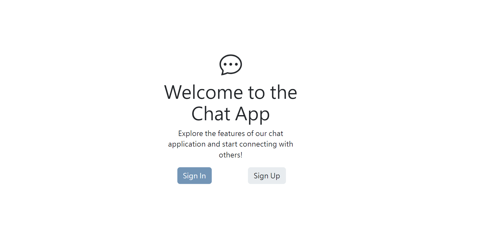
    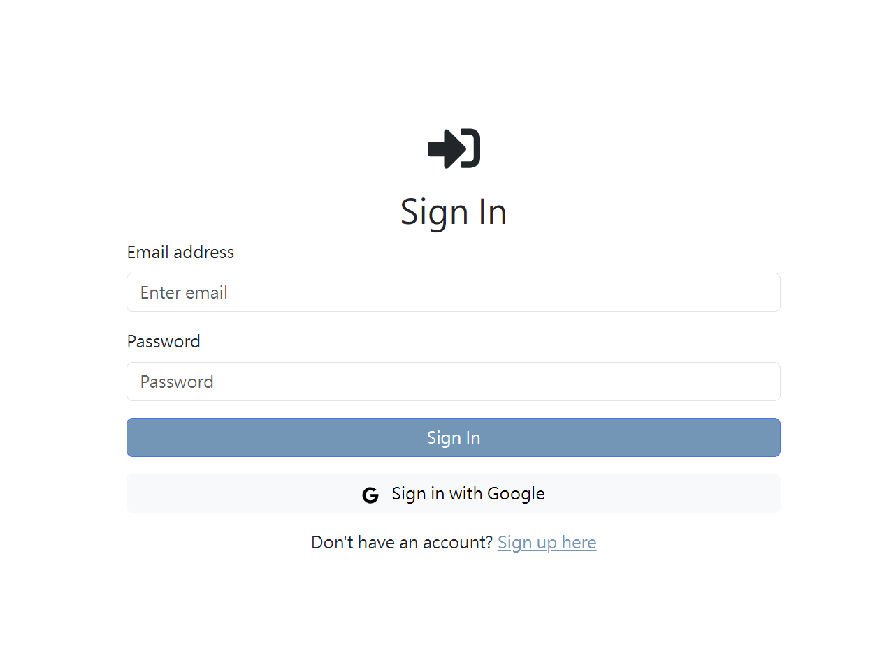
    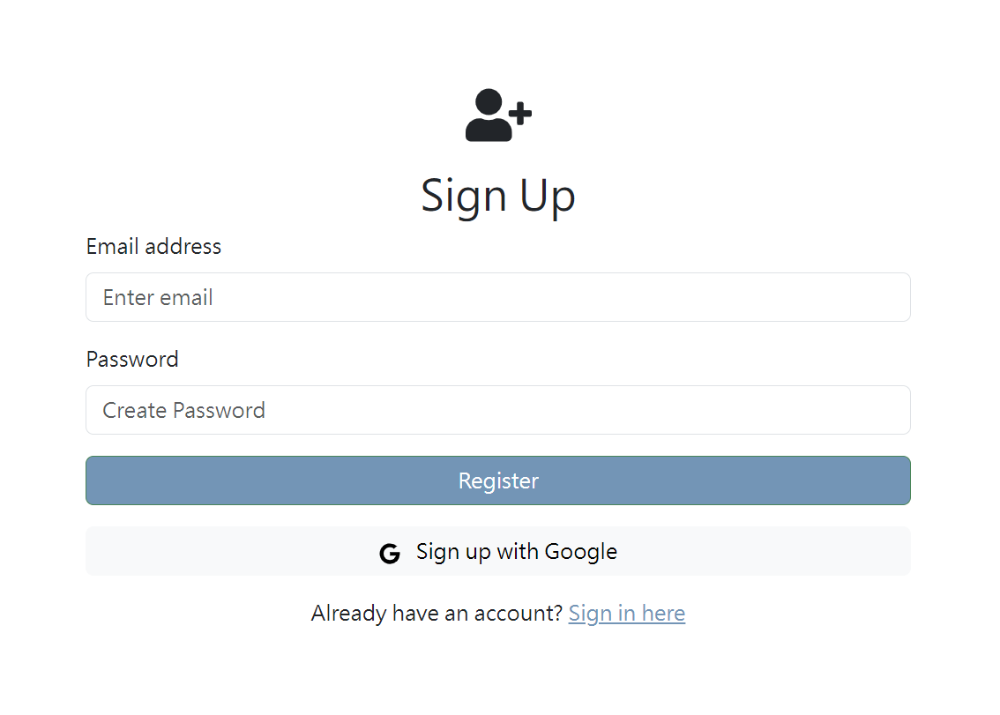
2.  #### Navigate the Main Page
    Once you're signed in, you'll land on the main page. Here, you can get a quick overview of various features the app offers.
    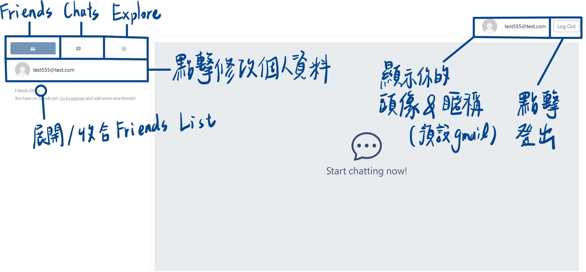
3.  #### Edit Your Profile
    To personalize your experience, head over to your profile page. Here, you can upload a profile picture, set a unique display name, update your birthday, and craft a status message to let your friends know what you’re up to.
    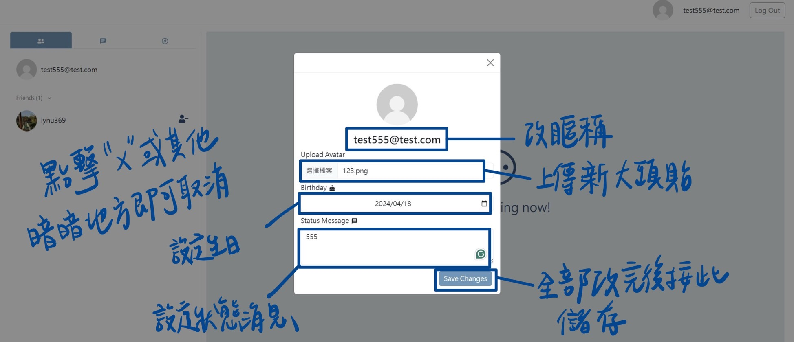
4.  #### Add Friends
    As a new user, your friend list might be empty. Just visit the Explore tab. Here you can discover other users and send friend requests.
    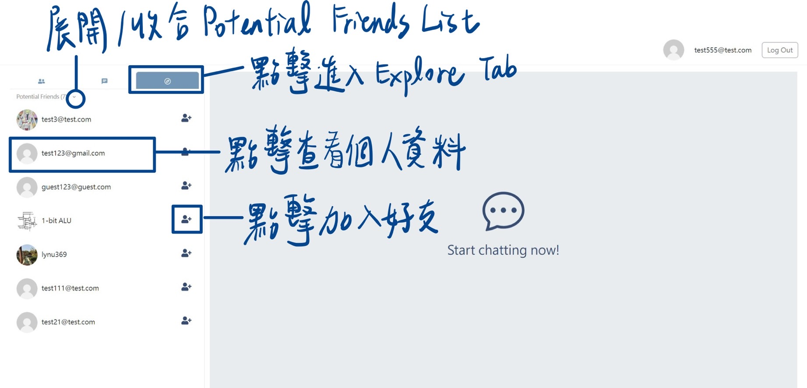
5.  #### Manage Your Friend List
    After adding some friends, you can view and manage your friend list under the Friends tab. You can also remove friends if needed by clicking the Remove Friend option.
    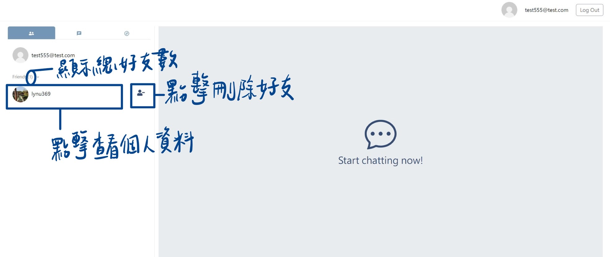
6.  #### Start Chatting
    Go to the Chat tab, select a friend, and start a conversation. If you ever need to unsend a message, just click the unsend button.
    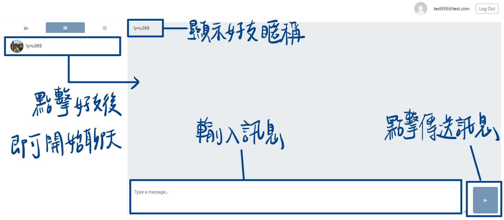
    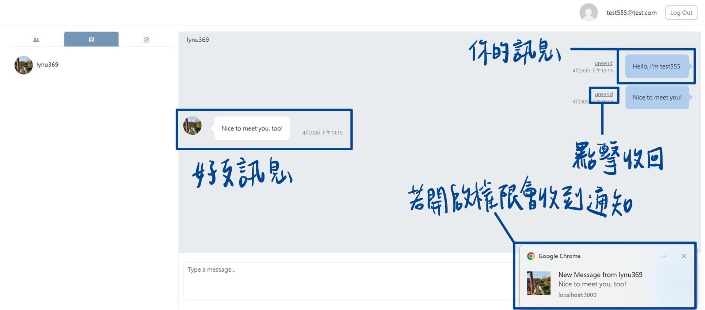

### Function description

1. #### Navigating to Chat
   To start chatting, simply click on the Go To Chat button.
   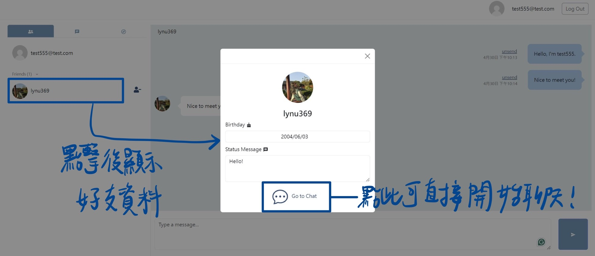
2. #### Adding and Removing Friends
   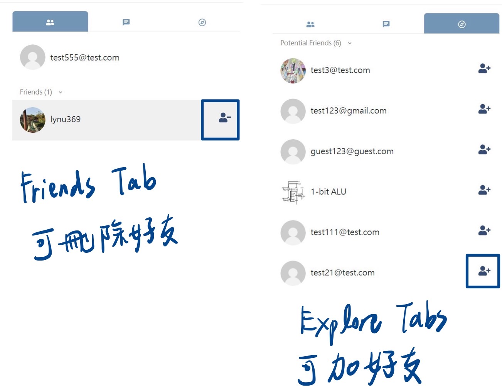
3. #### Automatic Scrolling in Chatrooms
   The chat application ensures you always see the most recent messages without manual scrolling. When you enter any chatroom, the application automatically scrolls to the bottom where the latest messages are displayed.
4. #### Profile Customization
   Personalize your profile by uploading a profile picture, setting a birthday, updating your status message, and choosing a display name.
5. #### Unsend Messages
   Simply click on the unsend button.

### Firebase page link

- `https://chatroom-6f533.web.app`
